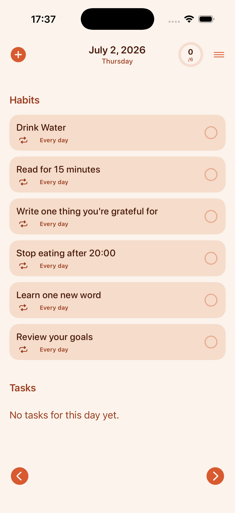
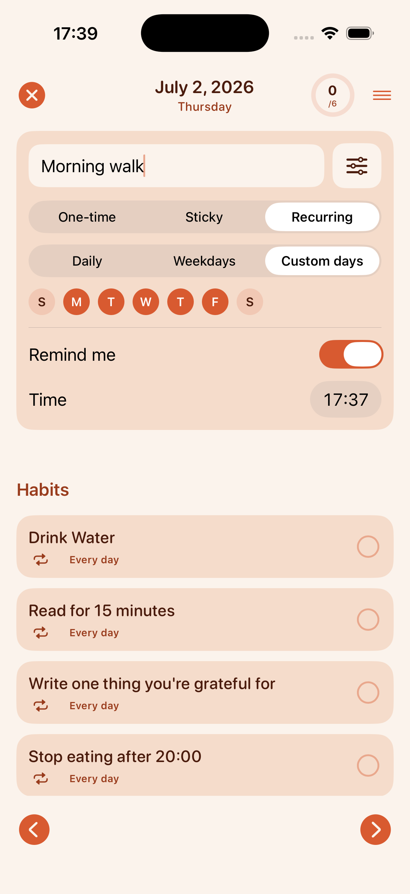
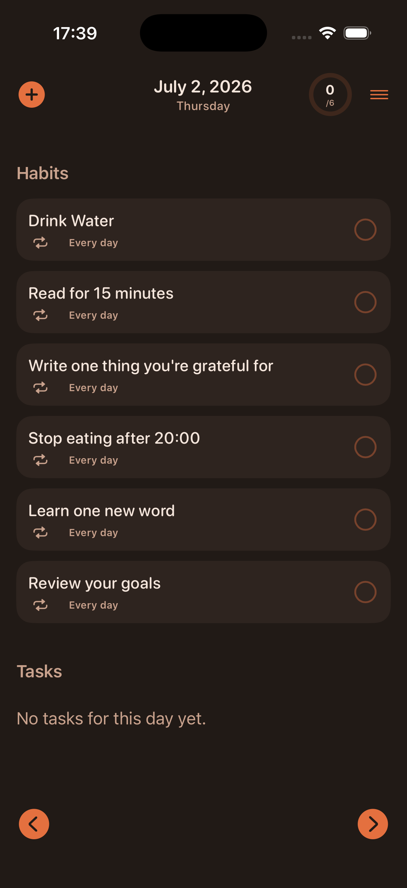

# 📅 Daily 2do

**Daily 2do** is a simple, fast iOS app for managing daily tasks and habits. Built with **SwiftUI** and **SwiftData**, it combines one-off tasks with flexible recurring habits, local reminders, and a warm, distraction-free design — all iPhone-only and portrait-only for a focused experience.

## ✨ Features

- ✅ One-time, sticky (carries over until done), and recurring tasks — all in one quick-add flow
- 🔁 Flexible recurrence rules — daily, weekdays, or custom days of the week
- 🔔 Optional local reminders for any task, with tap-to-open deep linking
- ⚡ Fast inline "add task" card — no modal popups, with an expandable Options panel for type/recurrence/reminders
- 🟢 Animated progress ring showing today's completed/total count, right in the top bar
- 🌱 Six starter habits (drink water, read, gratitude, and more) seeded automatically on first launch
- 📆 Navigate between dates using left/right arrows, or jump via the calendar picker
- 🗂️ Archive of completed tasks
- 🎨 Warm cream-and-coral "soft pastel wellness" theme with full Dark Mode support
- ✨ Animated launch splash and a matching progress-ring app icon
- 📱 iPhone-only, portrait-only — no iPad or landscape support

## 📸 Screenshots

| Daily list (light) | Quick add + Options | Daily list (dark) |
| --- | --- | --- |
|  |  |  |


## 🚀 Getting Started

1. Clone the repo:
    ```bash
    git clone https://github.com/ozSoffySwift/Daily_2do.git
    ```

2. Open the project in Xcode:
    ```
    open DailyToDo.xcodeproj
    ```

3. Build and run the app on an iPhone simulator or device (iOS 18.5+).

## 🛠 Technologies

- Swift 5 / Swift 6
- SwiftUI
- SwiftData for persistence
- MVVM + repository pattern (`SwiftDataTaskRepository`, `DailyTaskViewModel`)
- `UNUserNotificationCenter` for local reminders

## 👤 Author

**Oz Soffy**  
[GitHub](https://github.com/ozSoffy)

---

Want to contribute or suggest features? Feel free to open issues or pull requests.
